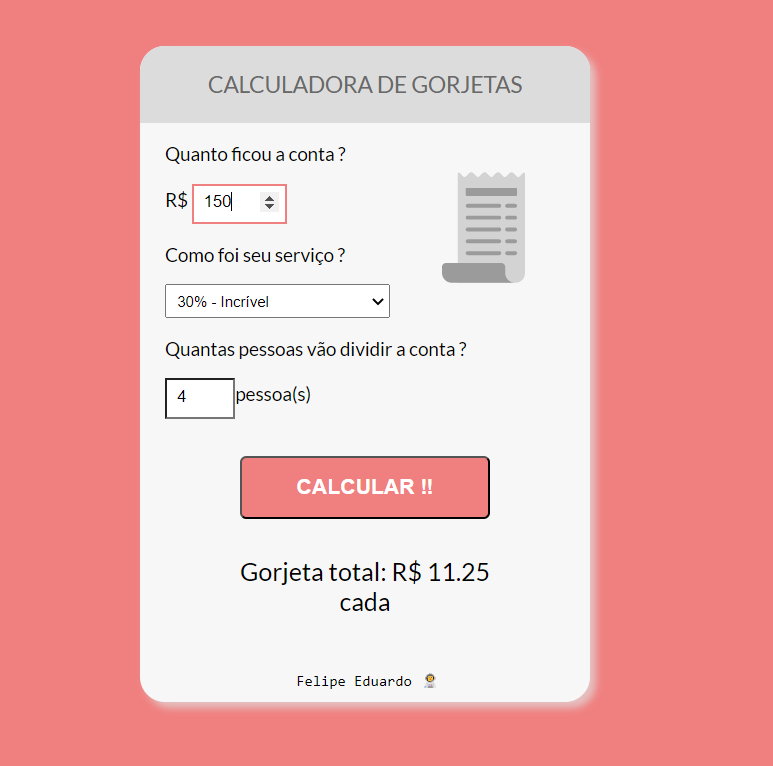

<h1 align="center"> Calculadora de gorjetas </h1>

 

  

## 🚀 Tecnologias

Esse projeto foi desenvolvido com as seguintes tecnologias:

- HTML
- CSS
- Javascript
- Git
- Github

## 💻 Projeto

Projeto simples mas funcional. Feito com o objetivo de treinar um pouco mais de Javascript aplicado em um caso real do cotidiano. 

A calculadora só aceita valores sem os centavos.  
Portando se o valor da conta for: R$ 150,60 => preencha o campo com 150 ou 151.

---